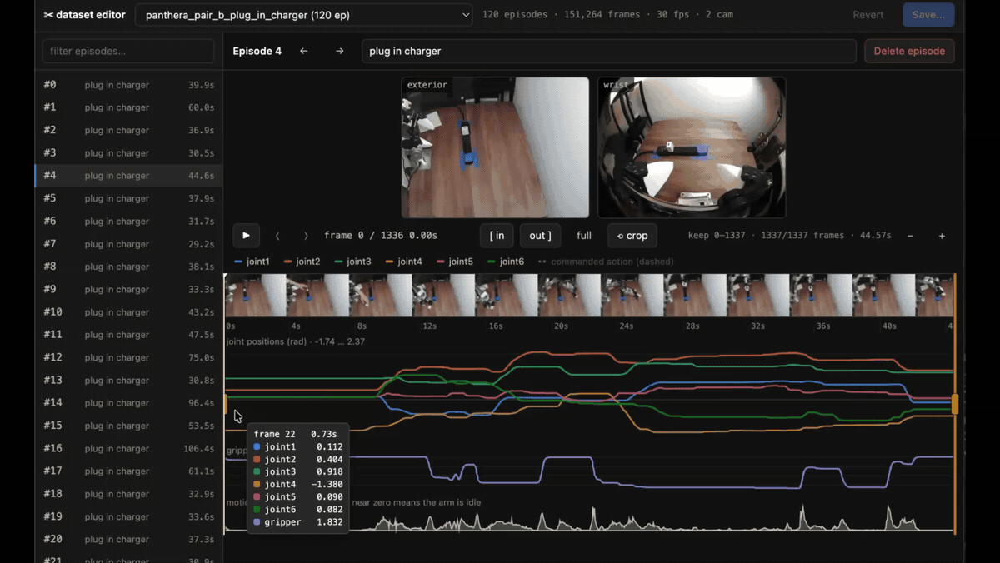

# lerobot-dataset-editor

A local web UI for reviewing and trimming **LeRobot v3.0** datasets: watch every
camera, see the joint traces, drag two handles to crop an episode's head and
tail, delete the takes that went wrong, fix the task text — then write it back.



```bash
./run.sh                                  # discovers datasets, opens a browser
./run.sh --root ~/data/datasets --port 8800
```

<sub>Built against the Panthera-HT arm's datasets (7-DoF, two 480×640 AV1 cameras
at 30 fps), but nothing here is arm-specific — it reads `meta/info.json`.</sub>

## Why edits are cheap and Rerun-safe

In v3.0 an episode is not its own file. Its frames are a contiguous run of rows in
a shared `data/**.parquet`, and a `(from_timestamp, to_timestamp)` window inside a
shared `videos/**/*.mp4`. So trimming k frames off the front is:

    from_timestamp += k / fps      and      k fewer parquet rows

**No video is ever re-encoded, and no mp4 byte changes.** That is what keeps the
result readable by `LeRobotDataset`, `lerobot_train`, and Rerun — the editor only
moves the pointers that say which part of the video an episode occupies. Deleting
an episode works the same way: the rows and its metadata row go, the remaining
episodes are renumbered 0..N-1, and the deleted segment stays inside the mp4 as
unreferenced bytes (disk, not corruption).

Verified on a real dataset: after a crop, a delete and a task edit, the decoded
frames are **pixel-identical** to the corresponding original frames, and the
repo's own `review_episodes.py --doctor` scores 98/100 with zero failures.

## What it looks like

| Pane | What it gives you |
|---|---|
| Sidebar | every episode, its task and kept duration; `✂` marks a crop, strike-through a pending delete |
| Viewers | one `<video>` per camera, frame-synced to the playhead |
| Timeline | a filmstrip of the episode with the two crop handles and the playhead |
| Charts | joints 1–6, the gripper on its own axis, and a motion trace (`Σ|Δstate|`) that makes idle lead-in and tail obvious |
| Crosshair | hover anywhere on the tracks for exact per-joint values at that frame |

### Keys

| | |
|---|---|
| `space` | play / pause |
| `←` `→` | step a frame (`shift` = 10) |
| `↑` `↓` | previous / next episode |
| `[` `]` | set crop start / end to the playhead |
| `\` | clear the crop |
| `+` `-` | zoom the timeline |
| `⌫` | delete the episode (asks first) |
| `⌘S` | save (asks first) |

## Staging, saving, backups

Nothing touches the dataset until you press **Save**. Edits accumulate in
`<dataset>/_editor/session.json`, keyed by episode index, so you can close the
browser mid-review and pick it up later. **Revert** throws them away.

Save rewrites `data/` and `meta/` in place, and before it does it hardlinks both
into `<dataset>/_backups/<timestamp>/`. Because the writers replace files by
rename rather than truncating them, those hardlinks stay valid — a backup costs
essentially no disk (a few MB) and restoring is one `mv`:

```bash
rm -rf DATASET/data DATASET/meta
cp -R DATASET/_backups/20260823-004654/{data,meta} DATASET/
```

What Save recomputes: `frame_index`, `timestamp`, the global `index`,
`episode_index`, `dataset_from_index`/`dataset_to_index`, the video windows,
per-episode stats, `meta/tasks.parquet` (with `task_index` remapped in the data),
`meta/info.json` totals, and the aggregate `meta/stats.json`.

Image statistics are the one thing carried over rather than recomputed: the
frames themselves never change, and a head trim moves a channel mean by far less
than the sampling noise in how lerobot estimated it. The aggregate is still taken
over exactly the surviving episodes, so deleting does move it.

## Previews

Source video is AV1 and holds many episodes per file — wrong for a browser twice
over. On demand, ffmpeg cuts each episode into its own small H.264 clip plus a
filmstrip sprite, cached under `<dataset>/_editor/cache/` (~200 KB per
episode-camera, ~0.5 s to generate, prefetched a few episodes ahead). Cache keys
are content hashes of *(video file, offset, length)*, so they survive the
renumbering a delete causes. That same hash rides in the clip and filmstrip URLs
as `&v=`, so after a save that re-cuts an episode the browser cannot serve you
the pre-edit clip out of its own cache — same token means identical bytes, so
caching stays aggressive without ever going stale. Reclaim the space with
**clear preview cache** in the sidebar.

Requires `ffmpeg` on `PATH`.

## Python

`run.sh` prefers, in order: `$LRDE_PYTHON`, the sibling
`../Panthera-HT_lerobot/.venv/bin/python`, then `uv run`. The venv is preferred
because it has `lerobot` importable, and the editor then uses lerobot's own
`get_feature_stats` / `aggregate_stats` — so the numbers it writes are exactly
what training would have computed. Without lerobot it falls back to numpy
quantiles (a slightly *more* accurate answer to the same question, but not
bit-identical). The startup banner says which one is in use.

Only `pandas`, `numpy` and `pyarrow` are needed otherwise; the server is stdlib
`http.server`.

## Layout

```
server.py          HTTP + JSON API, static files, byte-range video
editor/dataset.py  read-side model of a v3.0 dataset
editor/session.py  staged, un-applied edits (the sidecar)
editor/apply.py    the writer: backup, rewrite data/ + meta/, renumber
editor/stats.py    per-episode and aggregate statistics
editor/proxy.py    ffmpeg clip + filmstrip cache
web/               index.html, style.css, app.js, charts.js — no build step
```

## Limits

- v3.0 only (`codebase_version` in `meta/info.json`). v2.x is not read.
- Crops are contiguous — one in-point and one out-point per episode, no splitting
  an episode in two or cutting a hole out of the middle.
- Deleted and trimmed video segments are left in the mp4s. Nothing references
  them; if you want the bytes back, re-encode with LeRobot's own
  `dataset_tools.delete_episodes`, which writes a fresh copy.
- An episode must keep at least 2 frames — Save refuses a crop tighter than that
  and tells you which episode.
